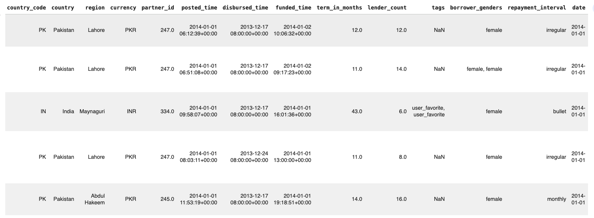
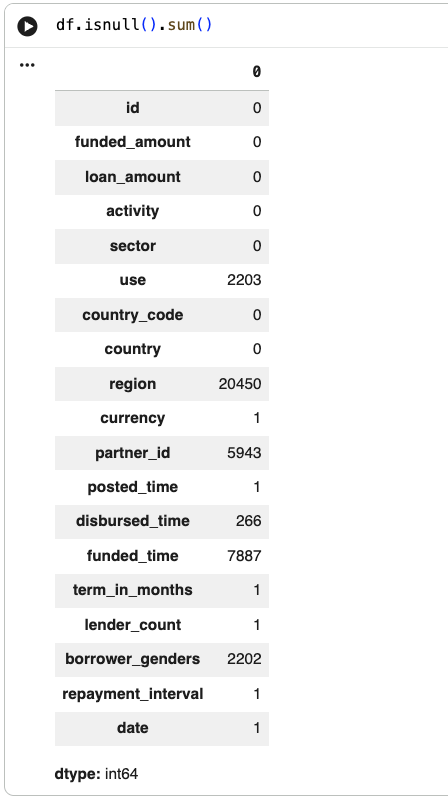
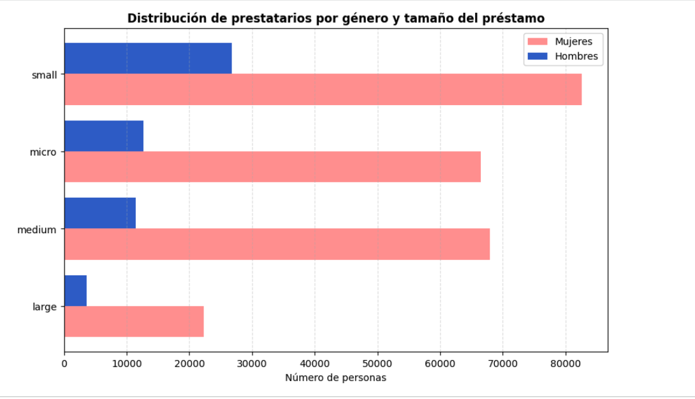

# Data Cleaning & Analysis: Kiva Loans Dataset 📊

## 🎯 Objetivo del Proyecto
Este proyecto consiste en la limpieza, validación y preparación de un dataset de Kiva. El objetivo principal es transformar datos brutos en un dataset estructurado y listo para el análisis, asegurando la calidad y claridad de los datos.

## 📂 Dataset
* **Fuente:** Kiva Loans Dataset.
* **Volumen inicial:** 15,439 filas y 20 columnas.
* **Variables principales:** `loan_amount`, `borrower_genders`, `country`, `term_in_months`.

## 🛠️ Tecnologías Utilizadas

* **Lenguaje:** Python
* **Librerías principales:**
    * `pandas`: Manipulación y limpieza de datos.
    * `numpy`: Operaciones numéricas.
    * `matplotlib y seaborn`: Visualización y detección de outliers.

## 🧠 Fases del Proyecto

### 1. Análisis Exploratorio Inicial
* Identificación de tipos de datos y estructuras.
* Detección de problemas de calidad y presencia de variables categóricas.
* Resumen estadístico inicial mediante "describe()" e "info()".

  

### 2. Limpieza y Preparación

* **Manejo de Fechas:** Conversión de variables temporales (`posted_time`, `disbursed_time`, `funded_time`, `date`) a formato `datetime`.
* **Tratamiento de Nulos:**
   * Se imputaron valores como `'unknown'` en campos de texto (`region`, `use`, `borrower_genders`).
   * Se asignó `-1` a `partner_id` cuando no había dato.
   * Se eliminaron filas con nulos en columnas en las que no había un riesgo al hacerlo como `term_in_months` y `repayment_interval`.
 
  

* **Estandarización:** Normalización de texto (minúsculas y eliminación de espacios) en `country`, `sector`, `activity` y `use`.
  
* **Optimización:** Conversión de tipos de datos de `float` a `int` para variables como `funded_amount` y `lender_count`.

### 3. Ingeniería de Variables (Feature Engineering)

Se crearon nuevas métricas para mejorar el análisis:
* **Género:** dos nuevas columnas llamadas `num_female` y `num_male` gracias al campo `borrower_genders`.
* **Conteo:** Creación de `total_borrowers` para indicar el número total de prestatarios.
* **Tiempo:** Extracción de columnas de `month` y `year` a partir de la fecha.
* **Categorización:** Creación de la variable `loan_size` para clasificar préstamos en rangos: **micro** (<500), **small** (<2000), **medium** (<5000) y **large** (>=5000).

### 4. Validación y Visualización

* **Validación:** Agregaciones por país para verificar la consistencia de los montos promedio y totales.
* **Outliers:** Identificación visual de valores atípicos en `loan_amount` mediante un boxplot.
* **Tendencias:** Visualización de la evolución del dinero recaudado por año y distribución geográfica de los préstamos.
  

## 📈 Conclusiones Principales

* **Predominio de Género:** Existe un claro predominio de mujeres en los préstamos en el dataset.
* **Liderazgo Geográfico:** Filipinas es el país con mayor cantidad de préstamos distribuidos.
* **Distribución:** La mayoría de los préstamos se concentran en los rangos "micro" y "pequeños".
* **Valores Extremos:** La variable `loan_amount` presenta una distribución sesgada con outliers que representan valores reales, por lo que no se eliminaron.

## ✅ Decisiones de limpieza

- No se eliminan registros salvo casos justificados  
- Los valores nulos se imputan según la naturaleza de cada variable  
- Se prioriza mantener la información frente a eliminar datos  
- Se evita introducir valores artificiales  

## ▶️ Cómo ejecutar el proyecto

1. Abrir el notebook en Google Colab  
2. Ejecutar todas las celdas en orden  
3. Generar el dataset limpio  

## 📦 Resultado final

Se genera un dataset limpio:
`kiva_clean_final.csv`

---
*Este proyecto fue desarrollado utilizando Google Colab y Python.*

